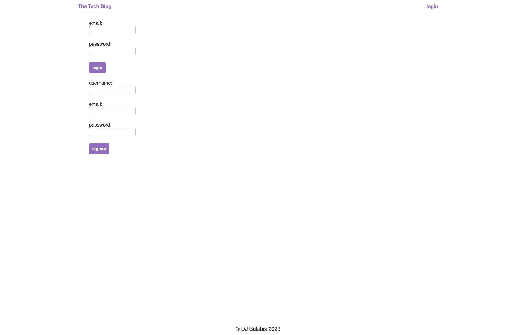
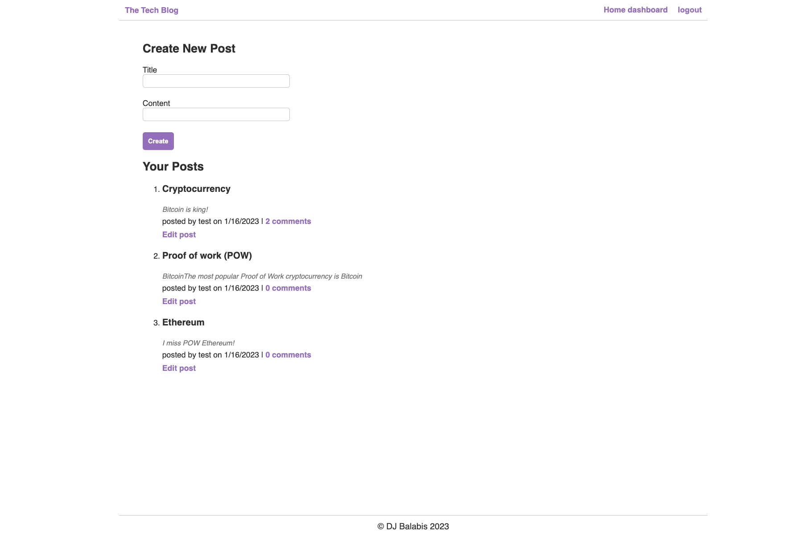
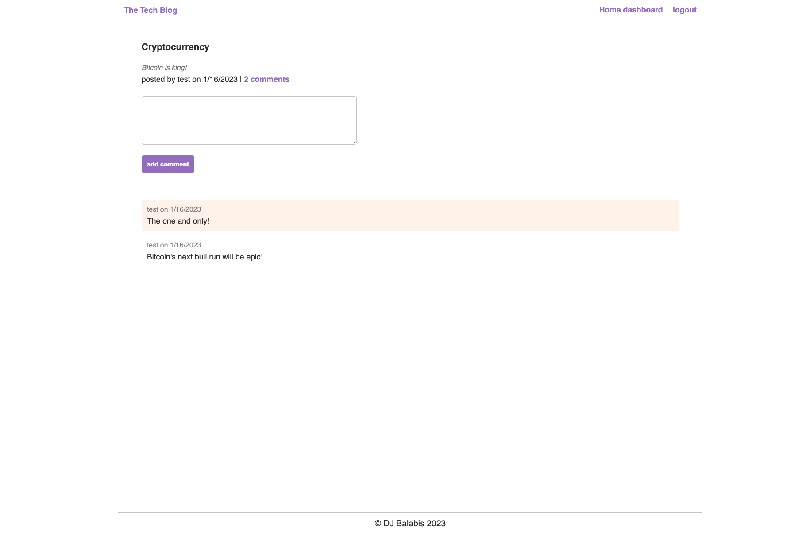
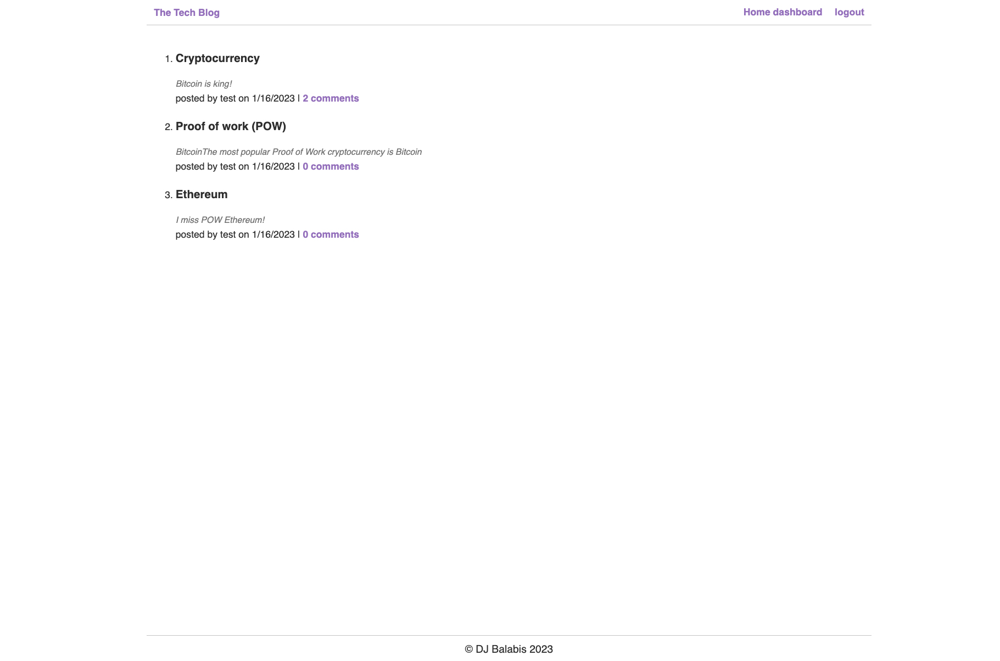

# Tech-Blog

## Description
This application is a CMS-style blog site that allows users to publish articles and blog posts and the latest technologies and comment on other developers' posts as well. This application follows the Model View Controller (MVC) architectural structure, uses Handlebars.js as the templating language, Sequelize as the ORM, and express-session npm package for authentication. The user is presented with the homepage, which includes existing blog posts if any have been posted, navigation links for the homepage and the dashboard, and the option to log in.

## Built With
* JavaScript
* Express.js
* Sequelize
* Mysql2
* dotenv
* express-handlebars
* bcrypt
* express-session
* connect-session-sequelize

## Installation
1. Clone the Git repository and run as an integrated terminal.
2. run "npm install"

## Usage
Clone the repository, navigate to the project folder in your CLI and run 'node server.js' or view the deployed application on Heroku https://shrouded-gorge-52944.herokuapp.com/.

## Mock-up

The following images show the web application's appearance and functionality:

